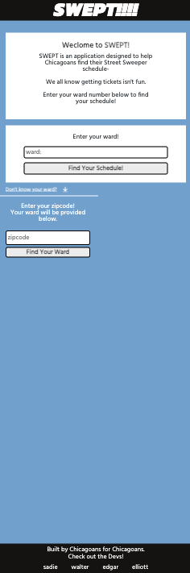

# SWEPT ✨ - (Bootcamp Project 1)
___
By: Sadie Sial, Edgar Ortega, Elliot Dombrowski, & Walter Armstrong - Team SODA
___
## User Story
```
AS A resident of Chicago, IL I’d like to know when I need to move my car so I do not get ticketed nor have my card towed because of the street sweepers.
I WANT to be able to enter my local ward to find the schedule of the city’s street sweeping. If I am unsure of my ward number, I want to enter a local zip code to find my ward.
SO I CAN park my car somewhere else and avoid being towed or being fined.
```

## Description
```
This application allows for users to view and learn their local City of Chicago street sweeping schedules. Designed to be mobile-first and user-friendly, SWEPT  provides you with your ward and street sweeper schedules at the click of a button. 

Users can input their ward number if they are familiar, and view the current months street schedule for their ward section. They will also be provided with a ward map to further investigate the city's sections for more precise viewing.

Previously searched wards will appear to the side so that users can toggle between several wards, or even clear all their history.

For users that are unaware of their ward, they can utilize a Chicago zipcode so that they may find their ward, as well as their alderman repsonsible for their ward's representation. Zipcodes that do not automatically align with precise wards can utalize the City of Chicago resources to further narrow down their ward information.

This one is for the Chicagoan that *DARE* keep their cars in the city.

```


## Screenshots
```
Mobile View:
```

Initial Display             |  Results Display
:-------------------------:|:-------------------------:
  |  

```
Desktop View:
```



## Links

[Deployed App](https://elliottdombrowski.github.io/NU-Project-1/)

[GitHub Repository](https://github.com/elliottdombrowski/NU-Project-1)


