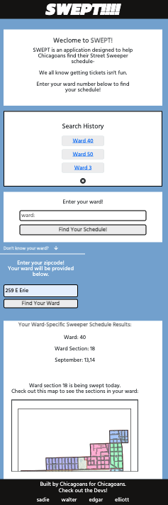
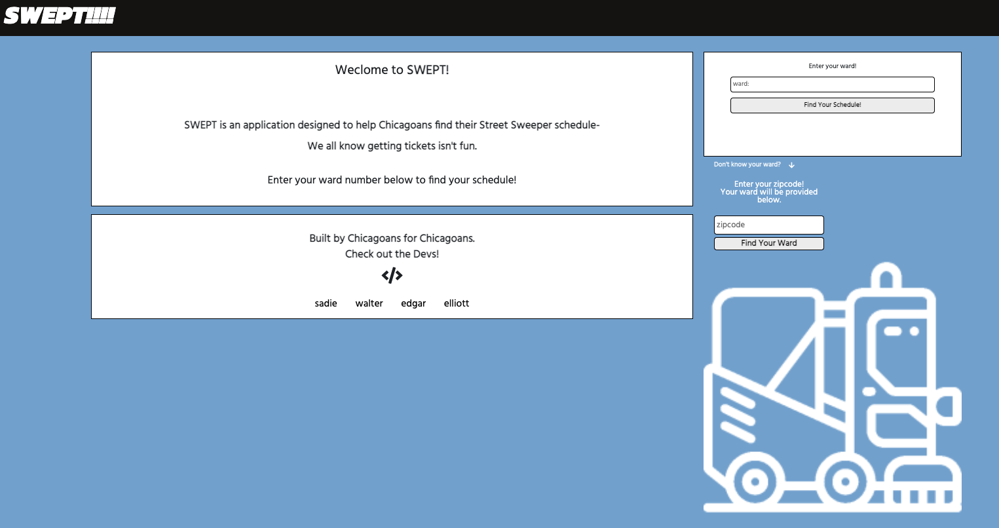
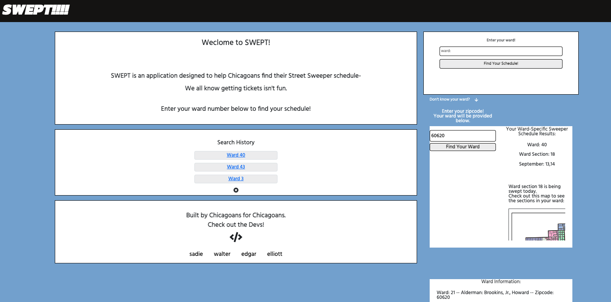

# SWEPT ✨ - (Bootcamp Project 1)
___
By: Sadie Sial, Edgar Ortega, Elliot Dombrowski, & Walter Armstrong - Team SODA
___ 
<br>

## User Story
```
AS A resident of Chicago, IL I would like to know when I need to move my car for the city's street sweeping schedule.
I WANT to be able to enter my local ward to find the schedule of the city’s street sweeping. If I am unsure of my ward number, I want to enter a local zip code to find my ward
SO I CAN park my car somewhere else and avoid being towed or being fined.
```

## Description
```
This application allows users to view and learn their local City of Chicago street sweeping schedules. Designed to be mobile-first and user-friendly, SWEPT  provides you with your ward and street sweeper schedules at the click of a button. 

Users can input their ward number if they are familiar with it and view the current month's street schedule for their ward section. They will also be provided with a ward map to further investigate the city's sections for more precise viewing.

Previously searched wards will appear to the side so that users can toggle between several wards or even clear all their history.

Users who are unaware of their ward can utilize a Chicago zip code so that they may find their ward and their alderman responsible for their ward's representation. Zipcodes that do not automatically align with precise wards can utilize the City of Chicago resources to narrow down their ward information further.

This one is for the Chicagoans that *DARE* keep their cars in the city.

```


## Screenshots
```
Mobile View:
```

Initial Display             |  Results Display
:-------------------------:|:-------------------------:
  |  

```
Desktop View:
```

Initial Display 


<br>

Results Display




## Links

[Deployed App](https://elliottdombrowski.github.io/NU-Project-1/)

[GitHub Repository](https://github.com/elliottdombrowski/NU-Project-1)

[Google Presentation](https://docs.google.com/presentation/d/1iKI_aOi-vEQn0dh9-TsZ6vI-zKLnfa-qdVqa6DbRHTc/edit?usp=sharing)

<br>

## Team SODA
[Sadie ***S***ial](https://github.com/sadielinks) - [Edgar ***O***rtega](https://github.com/EdgarO93) - [Elliot ***D***ombrowski](https://github.com/elliottdombrowski) - [Walter ***A***rmstrong](https://github.com/BATORASAN)


